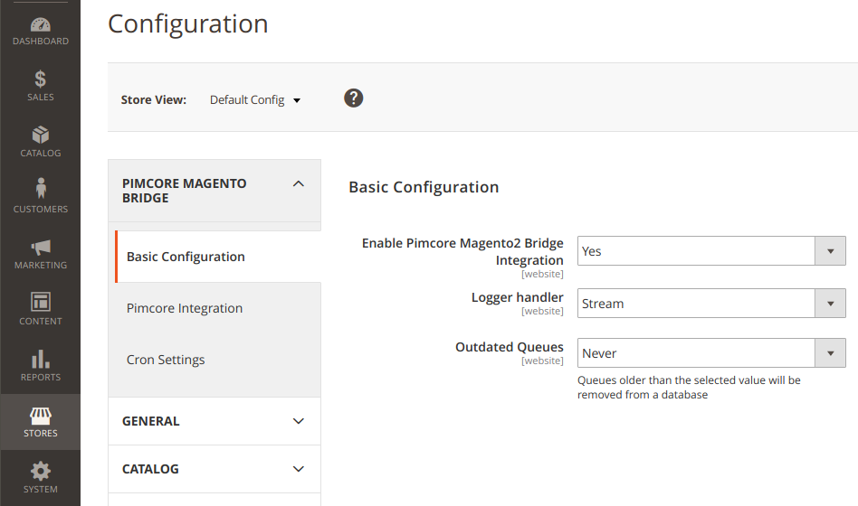
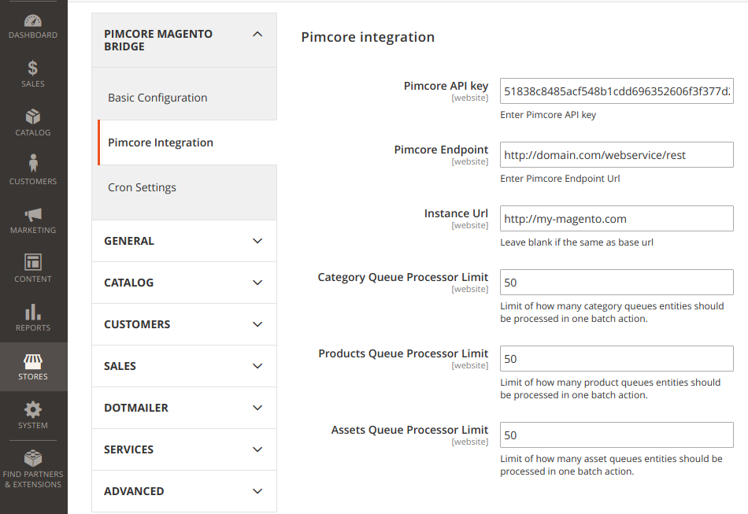
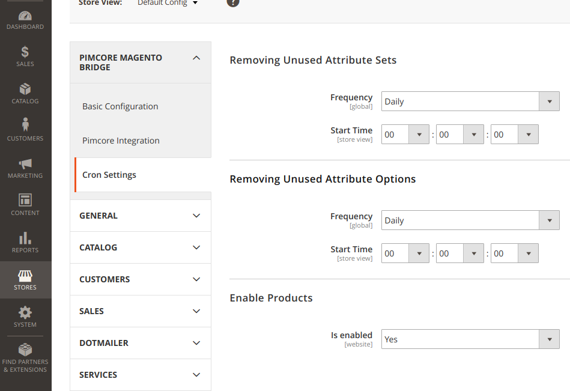

READ ME:

# Magento 2 - Pimcore Integration Module
This module is a part (1/2) of the Pimcore - Magento connector. 
It allows for integration between Magento 2 and Pimcore, including: 

* managing your Magento product information in Pimcore. 
* enriching product information by creating new attributes to suit your needs or by using existing ones. 
* publishing product information in Pimcore and exporting it to Magento with one click.
* creating categories, building them in a tree and exporting them easily to Magento.
* building up your media gallery, assigning assets and publishing it.

The second part of this module (Magento 2 - Pimcore Integration Module) is available at [DivanteLtd/pimcore-magento2-bridge](https://github.com/DivanteLtd/pimcore-magento2-bridge).

**Table of Contents**

- [Magento 2 - Pimcore Integration Module](#)
  	- [Big Picture](#big-picture)
	- [Compatibility](#compatibility)
	- [Installing/Getting started](#installation)
	- [Features](#features)
		- [Product Integration](#f1)
		- [Attributes Integration](#f2)
		- [Categories Integration](#f3)
		- [Assets Integration](#f4)
		- [Stores Integration](#f5)
		- [Dynamic creation of attribute sets](#f6)
		- [Translations](#f7)
		- [Unused options and attribute sets collector](#f8)
	- [Configuration](#configuration)
	- [Contributing](#contributing)
	- [Licensing](#licensing)
	- [Standards & Code Quality](#qa)
	- [About Authors](#authors)
	

## Big Picture

## Compatibility

This module is compatible with Magento 2.2.x and 2.3.x

## Installing/Getting started
###
- copy files to `<root>/app/code/Divante/PimcoreIntegration`
- `php bin/magento setup:upgrade`
- `php bin/magento module:enable Divante_PimcoreIntegration`
- configure the module in the Magento admin panel

## Features
The module introduces a broad integration of basic entities available in Magento.

#### Product Integration
The following types of products are supported:
* simple product
* configurable product

#### Attributes Integration
The following types of attributes are supported:
* boolean (yes/no)
* text
* textarea
* select
* multiselect
* wysiwyg
* object
* quantity-value
* visual swatch

*Object* is a special type of attribute that emits an event which allows us to implement any complex attribute type via third  party services.

#### Categories integration
Import of categories from Pimcore, perhaps structured in a tree.

#### Assets integration
Keep your media gallery in Pimcore, assign them to a category or product, and publish.

#### Dynamic creation of attribute sets
The module detects if attributes on a product belong to an existing attribute set and possibly create a new one.

#### Multi Store support
The module supports multi store, therefore any entity can be updated only in a predefined store.

#### Translations
All data can be easily translated - including attributes' labels and options.

#### Unused options and attribute sets collector
Whenever the module detects that some options or attribute sets are not used, it will remove them to prevent storing unnecessary data in a database.

## Configuration

The module configuration is available in the Magento Admin Panel. 
Go to Stores->Configuration->Pimcore Magento Bridge and then configure the following elements:

#### Basic configuration

* **enable pimcore-magento bridge integration** - enable/disable the module's functionality
    * yes
    * no
* **logger handler**
    * stream
    * graylog (unavailable yet)
* **outdated queues** - enables removal of old entries on queue stack

#### Pimcore Integration

* **Pimcore Api Key** - API key of integration configured in Pimcore
* **Pimcore Endpoint** - Pimcore API endpoint [domain]/webservice/rest
**IMPORTANT! "webservice/rest" is a mandatory part**
* **Instance Url** - instance URL of Magento which serves as communication identifier. In most cases, it is the same as the current instance's base URL.
* **Category Queue Processor Limit** - limit of how many category queue entities should be processed in one batch action.
* **Products Queue Processor Limit** - limit of how many product queue entities should be processed in one batch action.
* **Assets Queue Processor Limit** - limit of how many asset queue entities should be processed in one batch action.

#### Cron Settings

* **Remove Unused Attribute Sets** - removes attribute sets that are not used by any product
* **Remove Unused Attribute Options** - removes options that are not used by any select/multiselect attribute type
* **Enable Products** - enables products which have at least one image, stock and price set.

##### Products
More types of products must be covered in integration, therefore we are aiming to implement bundle and grouped product types.

##### Tests
1. Refactorization of unit/integration test - some tests are broken at the moment due to regression and must be updated.
2. Write integration tests to cover the most important scenarios

## Contributing

If you'd like to contribute, please fork the repository and use a feature branch. Pull requests are warmly welcome.

## Licensing
The code in this project is licensed under the MIT license.

## Standards & Code Quality
This module respects all Magento2 code quality rules and our own PHPCS and PHPMD rulesets.

## About the Author

This module has been created by Divante eCommerce Software House.

Divante is an expert in providing top-notch eCommerce solutions and products for both B2B and B2C segments. Our core competencies are built around Magento, Pimcore and bespoke software projects (we love Symfony3, Node.js, Angular, React, Vue.js). We specialize in sophisticated integration projects trying to connect hardcore IT with good product design and UX.

We work with industry leaders, like T-Mobile, Continental, and 3M, who perceive technology as their key component to success. In Divante we trust in cooperation, that's why we contribute to open source products and create our own products like [Open Loyalty](http://www.openloyalty.io/ "Open Loyalty") and [VueStorefront](https://github.com/DivanteLtd/vue-storefront "Vue Storefront").

Divante is part of the OEX Group which is listed on the Warsaw Stock Exchange. Our annual revenue has been growing at a minimum of about 30% year on year.

For more information, please visit [Divante.co](https://divante.co/ "Divante.co").
